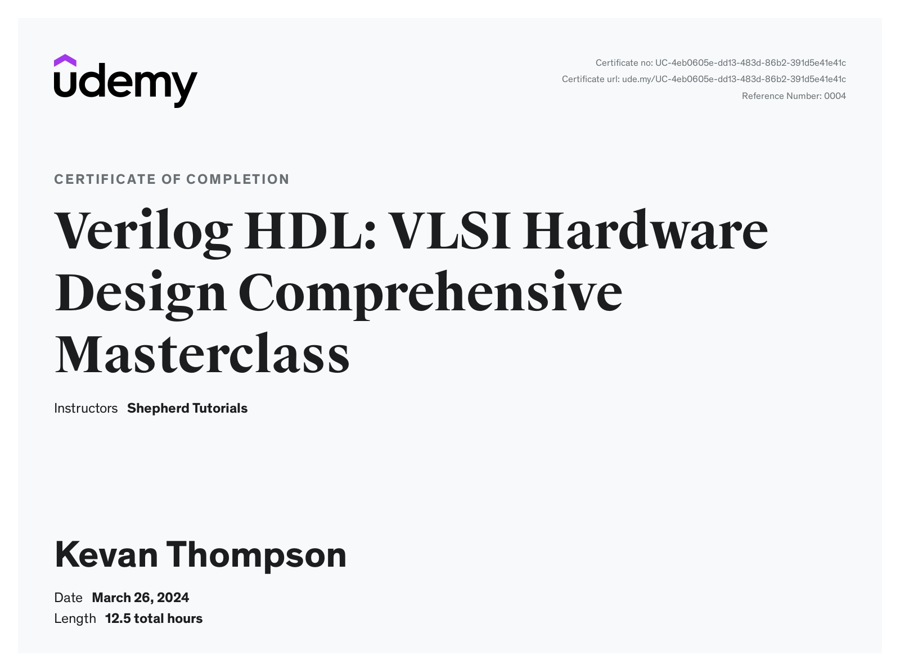

# Verlilog HDL - VLSI Hardware Design Comprehensive Masterclass
---

A job oriented exhaustive course on logic design for hardware using the Verilog Hardware Description Language.

Unique, tested and proven structured style and approach followed.

Thoughtful blend of theory and practice for your learning.

Unlimited support with the instructor.

Understand all the intricate details in thinking and understanding hardware design.

Principles are reinforced with multiple examples.

Good coding guidelines and bad examples to avoid.

After completing the course, you can confidently write synthesizable code for complex hardware design.

Thorough discussion of every hardware component design.

Detailed explanation of the relationship between code and digital hardware units.

Freely download 100+ code examples and test benches used in the course.

Access to all the materials and the future upgrades.

Loads to quizzes and assignments to check your understanding.

Work through the lessons at your own pace. 

**Lesson 1**: Introduction (No Code)   
**Lesson 2**: Verliog Basics   
**Lesson 3**: Designing Combinational Logic   
**Lesson 4**: Designing Sequential Logic   
**Lesson 5**: Desiging Memories   
**Lesson 6**: Desiging Finite State Machine   

