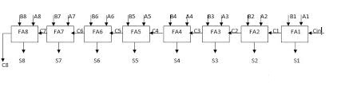

# Tutorials
---

This folder contains a basic VHDL files, TestBenches, and FPGA projects used to teach co-ops to write VHDL.

## 1) Basic Gates

The file **gates.vhd** will show you how to create all the basic logic gates in VHDL. (NOT, AND, OR, XOR, NAND, NOR, and XNOR) as well as explain some of the basics of a VHDL file.

The testbench **gates_tb.vhd** is a basic testbench that can be used to simulate gates.vhd in your simulator of choice. (Modelsim etc) and explains some of the basics of a TestBenches

## 2) Adders

The file **full_adder.vhd** implements a full adder. The circuit for a full adder is shown below:

A testbench for the full adder is found in **full_adder_tb.vhd**

The full adder is then used as a component in **ripple_carry_adder.vhd** to create an 8 bit ripple carry adder. The circuit for an 8 bit ripple carry adder is shown below.

The testbench for the ripple carry adder can be found in **ripple_carry_adder_tb.vhd**

## 3) TBD
