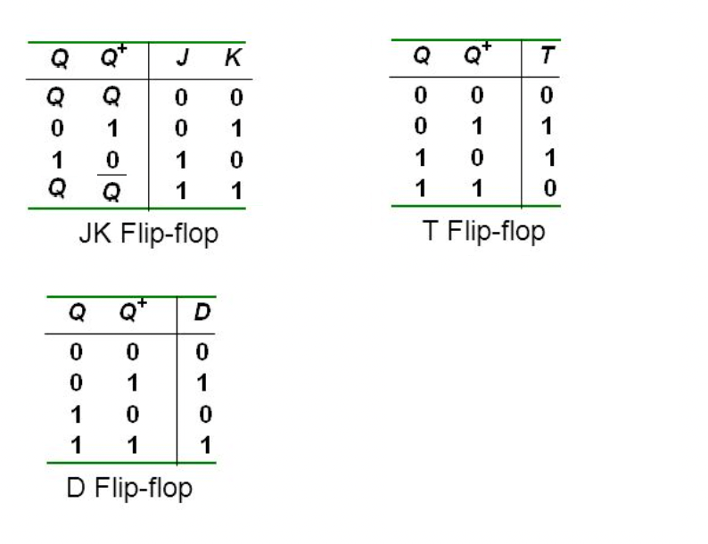
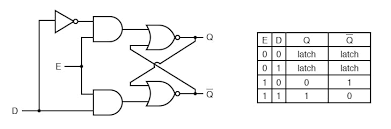
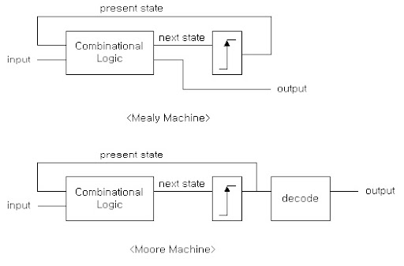
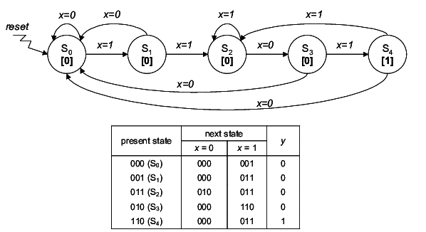

# Tutorials
---

This folder contains a basic VHDL files, TestBenches, and FPGA projects used to teach co-ops to write VHDL.

[Link to Free Version of Modelsim](https://www.intel.com/content/www/us/en/software-kit/750368/modelsim-intel-fpgas-standard-edition-software-version-18-1.html)

[Link to Vivado 2024.1](https://www.xilinx.com/support/download/index.html/content/xilinx/en/downloadNav/vivado-design-tools/2024-1.html)

## 1) Basic Gates

The file **gates.vhd** will show you how to create all the basic logic gates in VHDL. (NOT, AND, OR, XOR, NAND, NOR, and XNOR) as well as explain some of the basics of a VHDL file.

The testbench **gates_tb.vhd** is a basic testbench that can be used to simulate gates.vhd in your simulator of choice. (Modelsim etc) and explains some of the basics of a TestBenches

These files will show you how to:   
- Create a basic VDHL file
- Basic Logic operators
- How to use std_logic
- A simple testbench

## 2) Adders

The file **full_adder.vhd** implements a full adder. The circuit for a full adder is shown below:

A testbench for the full adder is found in **full_adder_tb.vhd**

The full adder is then used as a component in **ripple_carry_adder.vhd** to create an 8 bit ripple carry adder. The circuit for an 8 bit ripple carry adder is shown below.

The testbench for the ripple carry adder can be found in **ripple_carry_adder_tb.vhd**

These files will show you how to:   
- Use an std_logic_vector
- Instantiate components
- Create a gatelevel implementation of an adder
- A testbench with loops

## 3) Multiplexers

The file **multiplexers.vhd** contains five different implementations of a 2x1 multiplexer. (Shown  below) The implementations include a gate level implementation, a "when/else" implementation, a "with/select" implementation, an implementation using a process and if/else statements, and an implementation using a process and a case statement.

A testbench is implemented in **multiplexers_tb.vhd**. This testbench will show that each implementation has the same output for the same inputs.

These files will show you how to:   
- Do concurrent conditional assignments (When/Else and With/Select)
- Do sequential conditional assignments (If/Else, and Case)

## 4) Flip-Flops

The truth tables for D, JK, and T Flip-Flops are shown below:

A Flip Flop is essentially a 1 bit memory who's value changes on a rising or falling edge of a clock. A D, T, and JK flip flop are implemented in **d_flip_flop.vhd**, **t_flip_flop.vhd**, and **jk_flip_flop.vhd**

The truth table for a D Latch is shown below:

A latch is similar to a flip flop, except that it is level triggered and not edge triggered.

FPGAs are not designed to use latches. **DO NOT USE LATCHES ON FPGAs**

These files will show you how to:   
- Implement various flip flops
- Nested IF/ELSE/ELSIF
- Rising and Falling Edges

## 5) State Machines

Finite State Machines (FSM) are a type of sequential logic. This is a type of logic where the output depends not only on the current inputs, but also past inputs (aka the state)

There are two types of state machines, Mealy and Moore State machines. See below:

The main difference is the output of a Moore state machine depends only on the state. This requires 1 extra state, and the output will be synchronous to the clock.

The output of a Mealy state machine depends on the state, and the inputs. This means the output can change on a transition, and can be asynchronous to the clock.

State machines are often describes using state diagrams. These diagrams show when a state machine transitions from one state to another, and the output at each state or transition.

A classic state machine problem is sequence detection. The following state diagram describes a state machine to detect the bit sequence 110:

 This state machine is implemented in sequence_detect.vhd.
